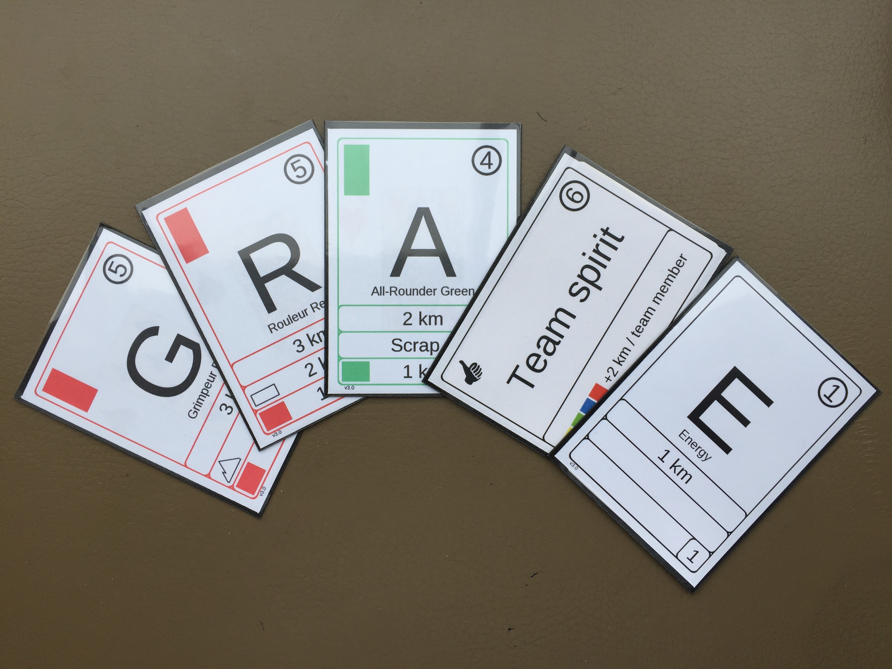

J'ai commencé en mars 2026 a raconter comment j'ai créé Fitzroy Games pour partager non seulement
les étapes de création d'entreprise mais aussi celle plus spécifique de l'édition d'un premier jeu.

## Un jeu bien né

Tout démarre par un jeu et par une étape de ma vie en Grande Bretagne.
J'étais alors dans un groupe de designer de jeux de société de Londres. Nous nous retrouvions chaque semaine dans le hall d'un bâtiment public. J'avais dans mes cartons une sorte de mille bornes qui aurait rencontré Star Realms et le tout dans le domaine de la course cycliste. Comme souvent dans les premiers design, trop d’idées nuisaient au jeu.

Une semaine, nous avons eu la visite de Brett Gilbert qui était plutôt affilié à un groupe équivalent de Cambridge. Nous avons tout de suite accroché et je lui ai proposé quelques jours après de collaborer sur 1000 bornes qui deviendraient bientôt Team Spirit.

Brett est un auteur reconnu et il a de nombreux jeux à succès à son actif. Notre collaboration a été fructueuse: il m’a forcé à simplifier et simplifier encore pour que le jeu devienne « UNO simple » comme l’exprime Brett.

Après de nombreux tests et des joueurs conquis autour de la table, j’ai su que j’avais un jeu.

## Quelques années de maturation

Et puis le jeu est resté dans sa boite. Je jouais de temps en temps avec des amis et tous m’encourageaient à le publier.
J’avais toutefois la conviction que j’étais fondamentalement plus un éditeur qu’un auteur. Un besoin immense de faire des choses concrètes: choisir la boite, les illustrations, faire un prix, travailler au marketing même. Un auteur abandonne sa création à l’éditeur qui en fait un produit. Dans l’édition de jeu de société c’est encore plus vrai que dans l’édition de livre car cette étape d’édition requiert des choix de production et d’illustration fondamentaux. 

C’était donc le moment de créer un éditeur : Fitzroy Games.
